# Contao Schema Manager 1.1

**Describe your company, people, products and services once. Connect them to your Contao content in every language.**

Contao Schema Manager adds shared Schema.org entities to Contao's existing JSON-LD graph. Editors manage company facts centrally, assign each entity a home page per language, and connect it to pages and news without maintaining JSON in HTML content elements.

For example, a hosting business can describe its company once, connect its hosting and maintenance services to it, and use the same people as authors throughout its blog. Each entity keeps one permanent identity even when a page moves or its description is translated.

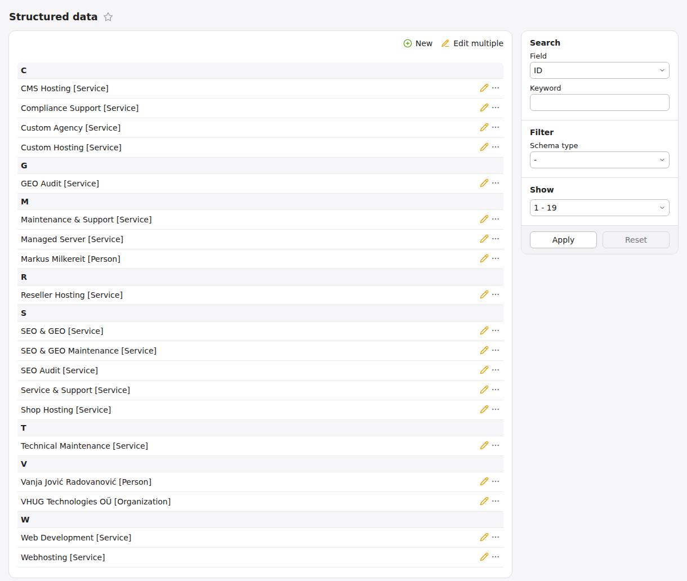

*Real examples from the bilingual VHUG Technologies pilot. Screenshots show the English Contao backend; German labels are also included. Product, contact, service-catalogue, job, office, qualification and event screenshots use unpublished documentation examples.*

> **Release 1.1.0:** PHP 8.3+ and Contao 5.7+ within the 5.x series. The News bundle is optional. The extension focuses on manually managed entities, localized homes and news enrichment. It does not select sharing images, generate social tags or read prices from content elements.

> **Versioning:** package versions follow semantic versioning independently of Contao. Version 1.1.0 requires Contao `^5.7` and PHP `^8.3`. The earlier 5.7.0 package release/tag has been withdrawn; existing users must change the package constraint to `^1.0` and run the Contao database update. See [versioning and migration](docs/versioning.md).

## Entity relationships

Available since **1.1.0** under **Structured data → Entity relationships**.

<table>
<tr><th>By relationship</th><th>By type</th><th>Webhosting selected</th></tr>
<tr>
<td><a href="docs/images/relationships.png">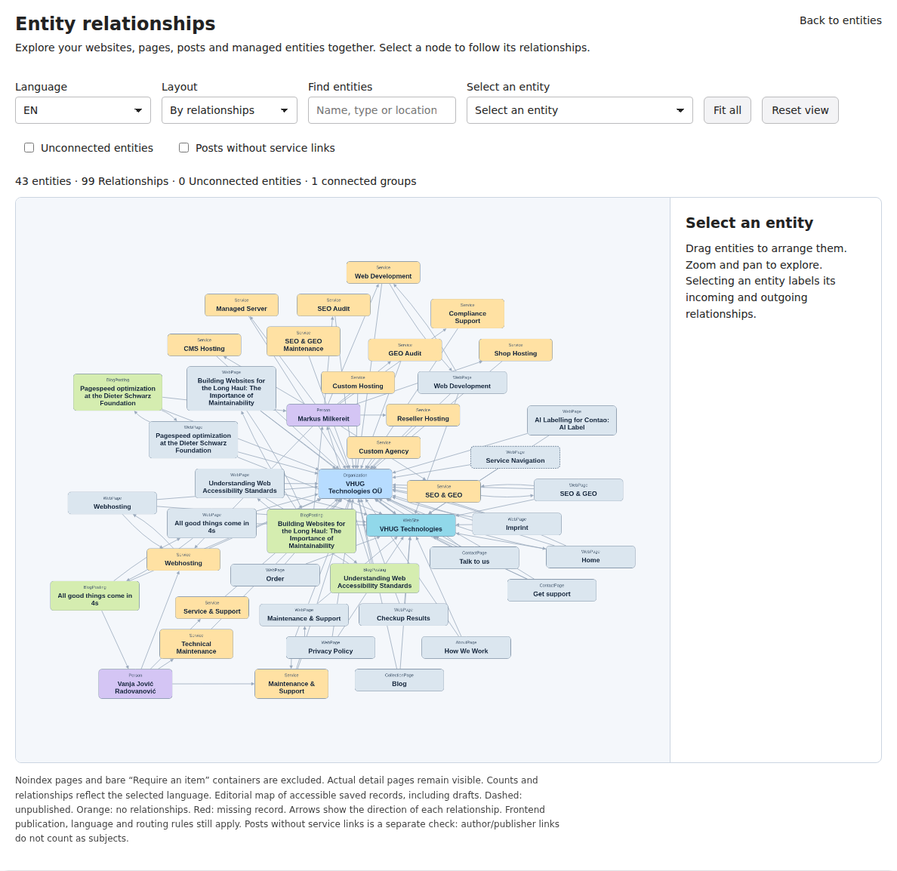</a></td>
<td><a href="docs/images/relationships-grouped.png">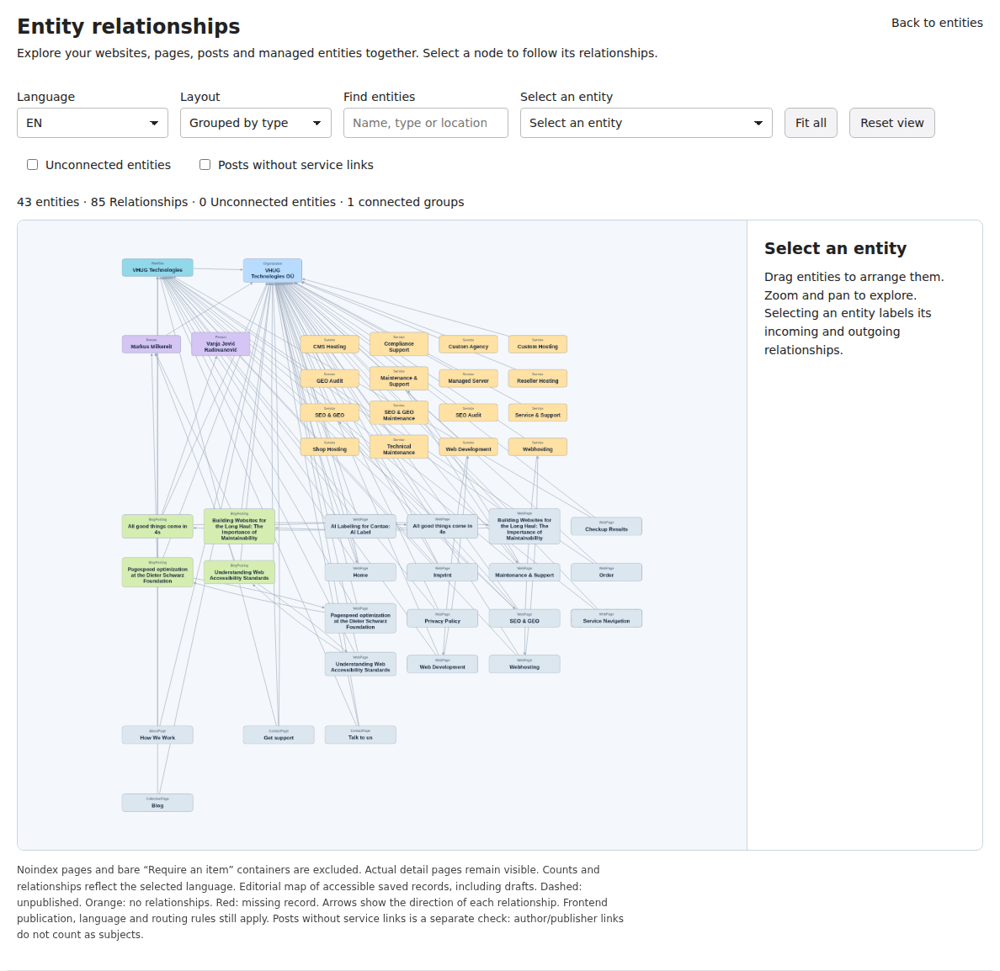</a></td>
<td><a href="docs/images/relationships-webhosting.png">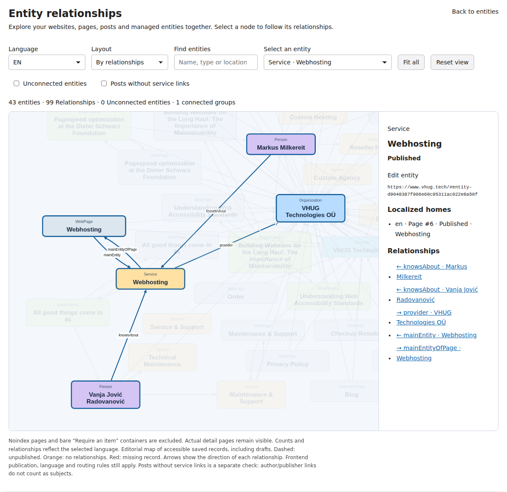</a></td>
</tr>
</table>

*Click a screenshot to view it at full size.*

The map shows managed entities, websites, pages and News-generated posts together, including drafts and entities without connections. `noindex` pages are excluded. Choose one language (shared entities stay visible), or all languages, and switch between relationship layout and grouping by type. Author, publisher, page membership and article subject links are visible. **Posts without service links** highlights articles without a direct `about`/`mentions` connection to a Service. Select a node (or use the keyboard-accessible entity selector) to see incoming/outgoing relationships, localized home assignments and an edit link. Search by name, type or location; use **Unconnected entities** to highlight records worth reviewing. LocalBusiness labels include street and postal locality to distinguish branches with the same company name.

News editors can select **Main subjects (about)** and **Mentioned entities (mentions)**; these also enrich the actual article JSON-LD. Apply the Contao database update for these optional fields and the linked knowledge topics field on entities.

See [scope, library choice and development notes](docs/relationship-map.md). After updating a path installation, install bundle assets with `php vendor/bin/contao-console assets:install public` and rebuild the cache.

## In this guide

- [Install](#install)
- [Understand entities, identities and translations](#understand-entities-identities-and-translations)
- [Initial setup](#initial-setup)
- [Manage services and solutions](#manage-services-and-solutions)
- [Manage products and offers](#manage-products-and-offers)
- [Manage pages](#manage-pages)
- [Manage news and blog posts](#manage-news-and-blog-posts)
- [People and standalone events](#people-and-standalone-events)
- [Preview and validate](#preview-and-validate)
- [Everyday maintenance](#everyday-maintenance)
- [Current scope and limitations](#current-scope-and-limitations)
- [Developer notes](#developer-notes)

## Install

Run Composer commands from your **Contao application root**, not from this package's directory. Back up the database before applying schema changes.

### Option A: install directly from GitHub

Register the repository and require the current release:

```sh
composer config repositories.schema-manager vcs https://github.com/vonheldenundgestalten/contao-schema-manager.git
composer require vonheldenundgestalten/contao-schema-manager:^1.1
```

The Git tag supplies the package version; there is no separate Packagist publication assumed here. If the repository requires authentication, configure Composer's normal GitHub access separately.

### Development preview: optional AI helper

The `codex/feature-schema-ai` branch includes the optional AI helper currently being tested. After registering the GitHub repository above, install this branch with:

```sh
composer require "vonheldenundgestalten/contao-schema-manager:dev-codex/feature-schema-ai"
```

Complete the cache, database and asset setup below. As an administrator, open **Structured data → AI helper** and save a dedicated OpenAI key, or configure `SCHEMA_AI_API_KEY` in the application's `.env.local`. Installing the package does not copy entities or configuration from another site.

The helper now separates initial setup into three stages:

1. **Organisation:** discover the website operator or improve its existing record. Homepage, legal and contact evidence is supplied together. Suggestions are restricted to organisations, localized homes and representative page links; services, products and individual news updates wait for stage three. Apply the desired proposals, then review and publish the new organisation and its localized homes in Contao.
2. **Websites and archives:** prepare a configuration review without an API call. Review each language root's publisher and public site name, then each accessible news archive's type and publisher. Existing types are preserved; choose BlogPosting, NewsArticle, Article, JobPosting or suppression explicitly when appropriate. A sole existing organisation is offered as a publisher, never silently applied. Draft publishers are labelled and can be assigned without publishing them. Selected changes use Contao versions, stale-value protection, identity backfills and cache invalidation. These settings affect child output; they do not create archive schema entities.
3. **Content enrichment:** discover new subjects or improve existing services, people, products and news using the reviewed foundation. Existing installations can open this stage directly. The helper recommends a starting stage from existing organisation and selected-root publisher settings; it does not certify every archive as complete.

On the events development branch, calendars with a public reader in the selected website participate in parent review: mode, organiser, event status, attendance and venue defaults can be reviewed before individual event enrichment. Standalone Event entities remain available.

Prepare a website/language inventory, then explicitly start analysis. Review grouped proposals before applying them; new entities and localized page assignments remain unpublished. Feedback can produce a separate revised review while preserving the original. Analysis and feedback send public source text and schema context to OpenAI and incur API usage. No API call is needed for ordinary schema management.

This is a development preview: it is currently administrator-only. By default it includes published language roots on the same domain and uses Contao page translation links (`languageMain`) to propose missing localized entries for one shared entity. Existing translations are preserved by the localization pass; missing or ambiguous page links require manual review. Some schema fields and software-specific relationships are not yet supported. Multilingual runs scan all included sources to retain the translation context; disable **Include the other languages of this website** for a single-language incremental scan. For a complete first single-language scan, uncheck **Only new or changed content**. See [the AI implementation plan and pilot limitations](docs/schema-ai-plan.md).

Only currently active public Contao records enter analysis: publication dates, website-root publication, inherited access protection, protected news archives, articles and content elements are respected. As in Contao, an unpublished intermediate navigation page does not exclude its published children. Draft schema entities and inactive homes are excluded from evidence and editing. A separate name/type identity reservation list prevents discovery from recreating existing entities, including unpublished drafts; it contains no descriptions or other draft content. Each batch refreshes this inventory; cached frontend HTML is not used to replace the filtered content. Custom content available only through rendered modules may therefore need manual input. Start a new analysis to discard suggestions from an older inventory.

Analysis processes sources in small batches and automatically continues through the queue. Keep the analysis page open. If another request is already processing a batch, the helper waits for saved progress; it also checks saved progress after an interrupted response. A failed or expired batch pauses for an explicit retry. **Stop after current batch** keeps completed work for later continuation.

Run `python3 tests/ai-browser.py` with Playwright/Chromium for offline batch UI regressions. Run `tests/ai-integration.php` from an installed Contao application root for mocked-provider/database checks; fixture writes roll back. These tests make no paid API calls.

### Option B: develop with a local package folder

This is the setup used by the pilot. Put a checkout or copy of this repository at:

```text
YOUR-CONTAO-APP/
  composer.json
  private-bundles/
    vonheldenundgestalten/
      contao-schema-manager/
        composer.json
        src/
        contao/
```

Add the following entry to the application's `composer.json` → `repositories`, preserving its other repository entries:

```json
{
  "type": "path",
  "url": "private-bundles/vonheldenundgestalten/contao-schema-manager",
  "options": {
    "symlink": true,
    "versions": {
      "vonheldenundgestalten/contao-schema-manager": "dev-main"
    }
  }
}
```

Then run:

```sh
composer require vonheldenundgestalten/contao-schema-manager:dev-main
```

Use either the path repository or the GitHub repository for this package. A path installation uses the local files; pushing to GitHub alone does not deploy changes to it.

### Complete the Contao setup

1. Rebuild the application cache, for example with `php vendor/bin/contao-console cache:clear --env=prod`.
2. Review and apply database updates through your normal Contao Manager workflow, or run `php vendor/bin/contao-console contao:migrate` interactively. Review unrelated proposed changes separately.
3. Sign into Contao as an administrator. Open **Content → Structured data**.
4. Grant appropriate module/field access to other backend users through the normal Contao permissions if needed.

The bundle registers through Contao Manager automatically. It adds `tl_schema_entity`, `tl_schema_translation`, and schema-related fields on existing Contao tables. No frontend module or JSON-LD content element needs to be placed on each page.

When updating a local package, synchronize its files and rebuild the Contao cache. When updating a Composer-managed version, update the package with Composer. Review database changes whenever an update adds fields.

## Understand entities, identities and translations

An **entity** is a real thing: a company, person, product, service or event. A **page** describes that thing. They are related, but their identifiers serve different purposes.

| Item | Example | Purpose |
| --- | --- | --- |
| Identity origin | `https://www.example.com` | Permanent public domain used to generate identifiers. No page path. |
| Permanent entity ID | `https://www.example.com/#entity-<generated-id>` | Identifies the same entity across languages and page moves. Generated on first save. |
| English representative page | `/en/hosting.html` | Home for the English service description. |
| German representative page | `/de/hosting.html` | Home for the German service description. |

The generated suffix is random; it does not depend on the database record ID or schema type. **Identity origin is fixed after the first save.** Use the public production domain even when editing on a staging server. Do not enter the staging domain or the service page URL.

The manager uses Contao to resolve representative-page URLs. Staging previews can therefore contain staging page URLs while their permanent entity IDs retain the production origin. Check the actual output again after deployment.

### What is shared, and what is translated?

| Shared entity facts | Localized child record |
| --- | --- |
| Permanent identity and type | Representative page and derived language |
| Organization/person name and legal name | Description |
| Address, telephone, email and legal identifiers | Product/service/event display name |
| Related organization and official profile links | Person's job title |
| Logo or portrait; event dates and venue | Main-subject assignment and publication |

Company and person names are shared; you do not re-enter the legal company name for each language. A Product, Service or Event can have a localized name, falling back to its shared name when empty.

Each entity can have **one localized home per language**. Several entities can use the same page—for example, several hosting packages described on one hosting page. News reader pages that require an item cannot be selected as these homes; news has its own integration.

## Initial setup

### 1. Create the company

Under **Content → Structured data**, choose **New**:

1. Select **Organization**, or **LocalBusiness** when that type genuinely describes the business.
2. Enter its shared **Name** and public **Identity origin**.
3. Add the legal name, public contact/address details and other applicable shared facts. Optional fields can remain empty.
4. Select an existing public logo and add official profile URLs, one per line.
5. Tick **Published** and save. Contao generates the permanent entity ID.

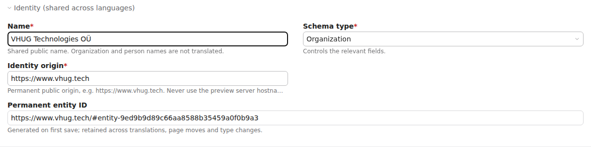

*The origin is the company website's domain, not the page assigned to a translation.*

### 2. Give it a home in each language

Open the entity's **child elements** using the list/tree icon beside it, or **Save and edit child elements**. Create a child record:

1. Select the regular homepage or company/about page for the first language as **Representative page**.
2. Save to derive the language from that page's website root.
3. Add a description matching the visible page content.
4. Select **Main subject of this page** when the page is primarily about this company.
5. Publish and save the child record.

Repeat for the other languages. You are translating the same company, not creating separate companies.

Both the parent entity and its localized child must be published for the localized description to appear. The home page must also be publicly available. If an entity is published but has no available home in the current language, a reference can still include its shared facts; it does not borrow another language's description. Unpublished entities are omitted entirely.

### 3. Connect the website publisher

In **Site structure**, edit the primary language's **website root**. Under **Structured data**:

- Choose the company as **Website publisher**.
- Set the public **Website name** and, if appropriate, a genuine **Alternative website name**.
- Save to generate the website's permanent identity.

For another language of the same website, select the primary root in **Share website identity with**. This connects both languages to one WebSite identity. Leave that setting empty for a genuinely separate website. Keep the roots' publisher settings consistent; a shared website uses its primary root's publisher.

Usually leave **Website homepage override** empty. The website homepage is independent of the company's representative page.

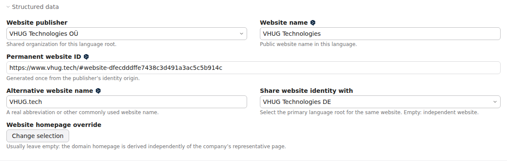

## Manage services and solutions

Use a **Service** entity for a service you actually provide: website development, hosting, maintenance or a consulting solution. Use Product for tangible or digital products; use Service for work you provide.

1. Create a Service with its shared name and identity origin.
2. Select the company as **Related organization**. The output connects it as the service's `provider`.
3. Publish the entity and add a child record for each language.
4. Choose the page describing the service and enter its localized name and description.
5. Mark it as the page's main subject when appropriate, then publish and save.

A service can be the main subject of its detail page and also be relevant to other pages. On those other pages, select it under **Structured data → Related entities**. This adds a relationship using the existing identity; it does not create another service or move its home.

**Main subject** connects a page with what it primarily describes (`mainEntity`). **Related entities** connects subjects relevant to that page (`about`). Select only entities supported by the visible content.

### Richer services and reusable catalogues

On the shared Service record, select the countries served and any existing Service entities to include in its offer catalogue. Each selected service keeps its own identity and localized home. Circular catalogues are rejected. Only services with a published home in the current language are linked; missing translations are not replaced with another language.

On each localized home, enter the service type, target audience and optional catalogue title. For example, a restructuring service can reference separate planning-review and restructuring-report services. Each subservice can have its own manual offer, or none. A catalogue does not require a public price.

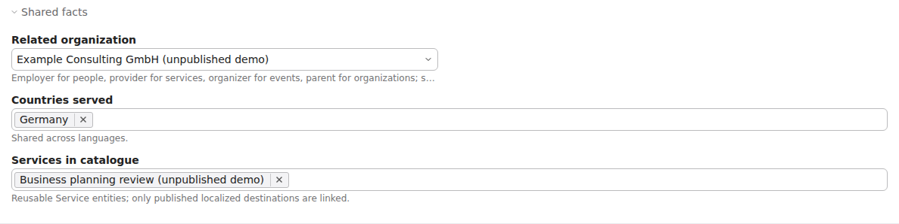
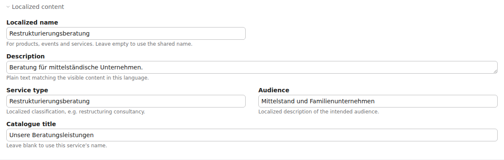

## Manage products and offers

Create a **Product** under **Content → Structured data**. Enter its shared name, identity origin, optional SKU, manufacturer part number (MPN), brand and product image. Related organization supplies the seller of its offers; it does not assert that the seller manufactured the product.

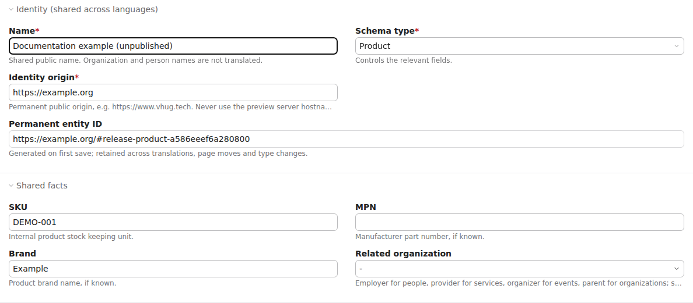

Add a localized child record for each language, select its representative page, and enter the localized name and description. Publish the entity and child when the corresponding page content is ready.

Products and Services both support one **Manual offer** per localized record:

| Offer type | What to enter |
| --- | --- |
| No offer | No price data is emitted |
| Exact price | Amount and three-letter currency, e.g. `19.90` and `EUR` |
| Starting price | Minimum amount and currency; emitted as `minPrice` |
| On request | Optional quotation explanation; no invented numeric price |

An optional billing unit supports month, year, hour or day; leave it empty for a one-off price. Select availability only when the visible content confirms it. Keep identifiers and the commercial meaning of translated offers consistent. There is no automatic currency conversion, tax calculation, inventory sync, variant system or checkout integration.

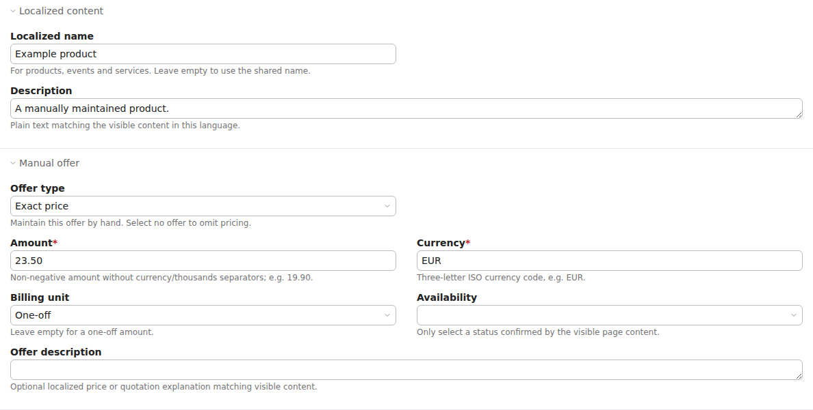

Amounts can use a decimal point or comma but no thousands separators; saving normalizes the decimal separator. An explicitly entered zero is allowed. For numeric prices, currency is required. The offer references its Product/Service and the selected seller using stable IDs.

**These values are maintained by hand.** Updating a pricing content element or shop record does not update this extension. When changing prices, update the visible page content and its manual offer together. Content-driven pricing is deferred to a separate feature branch.

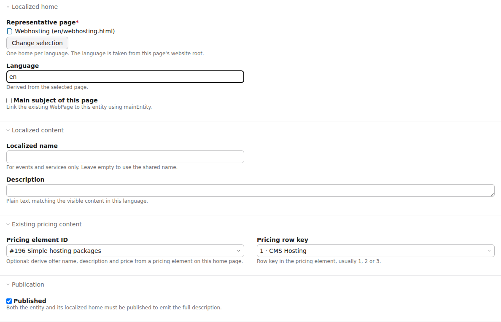

## Manage pages


Continue editing page titles, descriptions and content in their normal Contao screens. The extension reuses resolved page metadata, canonical URLs, language and core breadcrumbs.

### Choose the page's purpose

Edit a regular page in **Site structure → Structured data**:

| Page purpose | Typical use |
| --- | --- |
| `WebPage` | Default; suitable when no more specific type applies |
| `AboutPage` | About the organization or its work |
| `ContactPage` | Contact information |
| `CollectionPage` | An overview or collection, such as a blog index |
| `ProfilePage` | A page primarily describing a person or organization |
| `ItemPage` | A page primarily describing one item |

This changes the existing page node's type while preserving its other properties. The Service, Person or Article described on that page remains a separate linked entity. Selecting `ItemPage` does not create a Product.

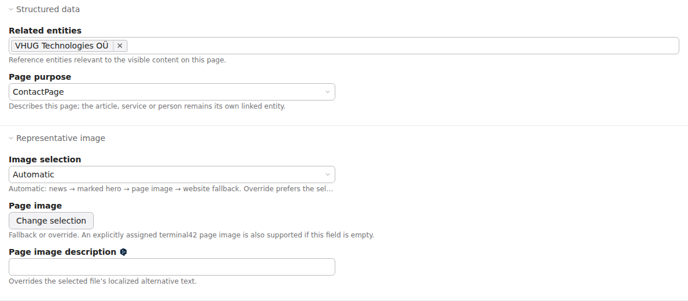

Release 1.0.0 leaves image selection and Open Graph/Twitter tags to Contao, your theme or your existing extension. Core ImageObject nodes and news article images are preserved. You can still assign a logo/portrait/product image directly to a managed entity; that is separate from page/social image selection.

## Manage news and blog posts

News stays in **News**. Do not create a separate entity manually for every blog post.

### Configure the archive once

Edit the news archive and choose **Structured data → Article schema**:

| Setting | Behavior |
| --- | --- |
| `core` | Keep Contao's article output |
| `BlogPosting` | Enrich/retype articles as blog posts |
| `Article` | Use a general article type |
| `NewsArticle` | Enrich articles as news reporting |
| `suppress` | Hide this archive's core article nodes |

Choose its **Publisher** and save. The publisher is needed to generate permanent article IDs; saving the archive also fills missing IDs for its existing posts.

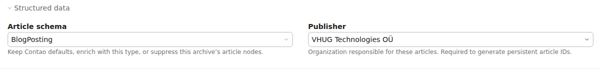

Enrichment replaces the matching core news node, retaining source content and unrelated graph nodes. Suppression only affects that archive's article output; it does not disable all structured data on the page.

### Connect authors once

Create a published **Person** entity for each public author. Then edit the corresponding backend user and choose **Structured data → Public author entity**. Backend account details and public author identity remain separate.

A person's localized home can be a profile/team page that actually describes them. Do not invent a profile URL: a person without a localized home can still provide a shared author identity.

### Edit posts as usual

The existing headline, publication date, article content and main image remain the source. Extra fields appear only for archives configured as `BlogPosting`, `Article` or `NewsArticle`:

- **Author entity:** optional override; otherwise the backend author's linked Person is used.
- **Content last revised:** set this for a real content revision, not an administrative save.
- **Permanent article ID:** generated automatically and retained when the URL/type changes.

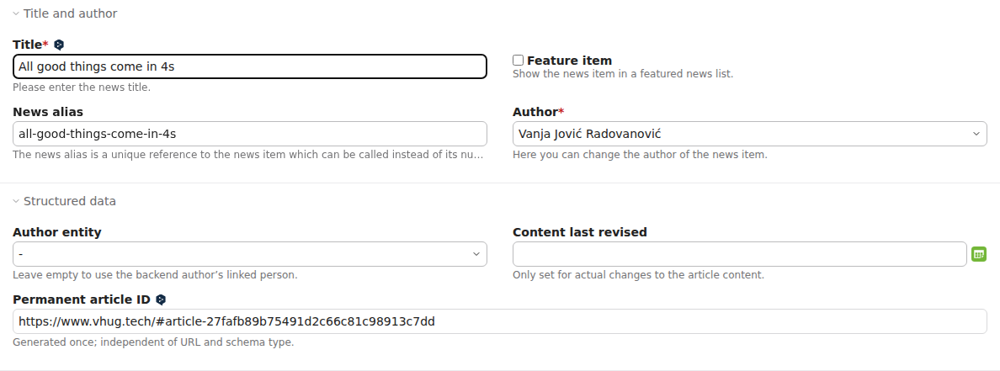

Where terminal42 changelanguage supplies a `languageMain` relationship, translated news links to the original through `translationOfWork`. Shared company/person identities stay the same across languages; translated news records have their own article identities.

### Jobs stored in News

1. Set the news archive’s **Schema type** to **JobPosting** and choose its **Publisher / hiring organization**. Save the archive to generate missing permanent IDs.
2. Set default employment types and workplace details on the archive. A physical or hybrid workplace needs a city and country. Fully remote jobs need eligible applicant countries; only fully remote jobs emit `TELECOMMUTE`.
3. Continue writing the title and full job description in the existing news record and its content elements. Job fields replace the article-author fields in this archive. Blank job-specific fields inherit archive defaults; set an override only where this job differs. A location override is field-by-field: review street, city, region and country together.
4. Optionally set an application deadline. Expired jobs emit no JobPosting; the news page remains published. Page cache lifetime is capped at the deadline. Use Contao’s publication controls when the page should disappear too.
5. Remove the old JobPosting RDFa/JSON-LD from the project’s job template when enabling this integration. The manager replaces Contao’s NewsArticle node, but cannot remove markup rendered by another template.

JobPosting appears only in a News reader, never in teaser lists. It references the shared hiring organization and uses the actual reader URL. Missing employer, description, posting date or required location data suppresses job schema. The news publication date supplies `datePosted`; do not change it merely to make a job look new. Use employment type OTHER where appropriate, rather than inventing a value.

Salary, application actions and multiple physical workplaces are not part of this first job integration. Archive defaults are scoped to that archive; translated archives can use their own defaults.

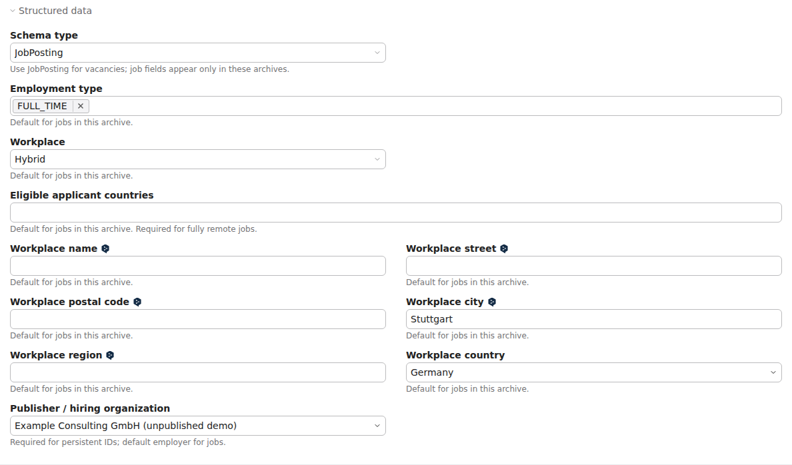
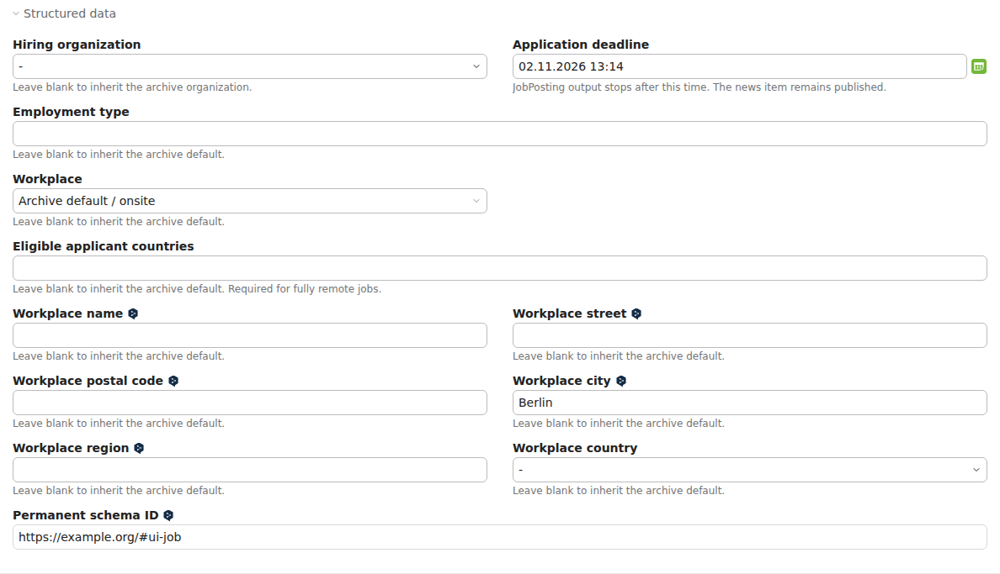


## Company details and contact points

Organization and LocalBusiness records now have a shared alternate name and founding date. Enter only the precision you know: `1998` or `1998-06-15`. The legal name remains shared and authoritative.

Use the **Contact points** operation beside an organization in the entity list to add public sales, support, billing, reservations or customer-service contacts. Each has its own phone/email, available language codes (for example `de, en`) and countries served. Contact points are shared across language homes. Purpose labels are translated in the editor; schema values remain stable. Publish a contact point when ready; at least one phone/email is required.

Full contact details appear with the full organization on its localized home and in saved previews. Other pages retain compact organization references.

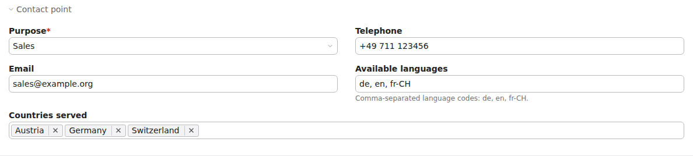

## Offices, groups and networks

Create one **Organization** for each legal company and one **LocalBusiness** for each physical office. An office’s Related organization is its actual parent company; this automatically adds a `location` reference from that company on its localized home. Organization children similarly produce `subOrganization` links. Do not classify every company in a business group as an office of the same legal entity.

LocalBusiness supports region, PO box, fax, coordinates, a map URL, weekly opening hours and a public price range. Enter both coordinates in decimal degrees. Opening hours use one period per line, for example `Mo-Fr 09:00-17:00`; use a second line for a lunch break or a different day. A day range without times means open all day. Do not mix a PO box’s mailing postcode with an unrelated street address. Special-date opening exceptions are not included.

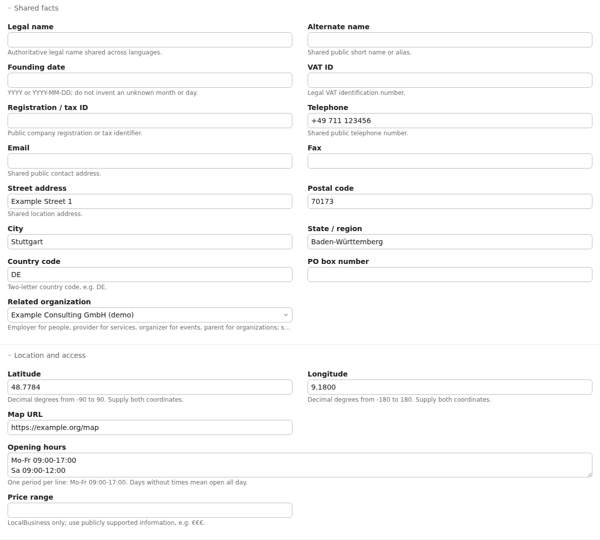

Use **Additional offices** for other locations that a group page visibly describes, beyond its direct LocalBusiness children. Choose **Member of** for networks and associations; membership does not imply ownership. For an external network, create an Organization with its established identity and External organization website. No local page is required. External-only references emit identifying facts and their website URL; they do not use locally uploaded logos. A published local home takes precedence over the external URL.

Organizations and offices can select their own **Service catalogue**, using the same reusable Service records as service-to-service catalogues. Catalogue titles, slogan, expertise and awards are localized; legal names, employee counts and office facts are shared. Employee counts emit a QuantitativeValue. Use only publicly supported expertise, awards and price ranges.

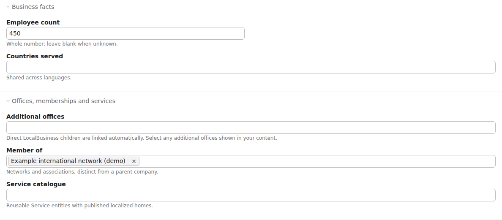
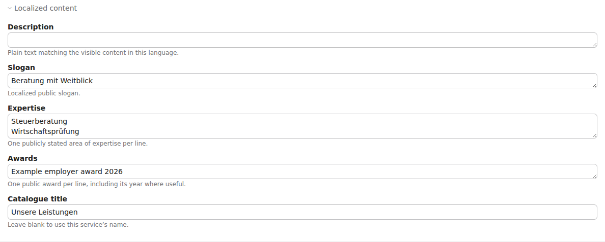

For a contact page that visibly lists office addresses and phone numbers, enable **Location overview with contact details** in the page’s structured-data settings, and select its offices as Related entities. This retains address, telephone, email and parent links in supporting LocalBusiness nodes. Other pages remain compact. Multiple office entities may share the same localized contact page as their home; distinct entity IDs still identify each office.

## People and standalone events

For a Person, put the name, portrait, public telephone/email and actual related organization on the shared entity. Put the biography/description, job title and representative page on the localized children. The related organization becomes `worksFor`, so only set it when that relationship is accurate. Choose physical offices separately under **Workplaces**. Expertise, awards and professional qualifications are localized; one qualification per line becomes an EducationalOccupationalCredential. Names and public contact details remain shared.

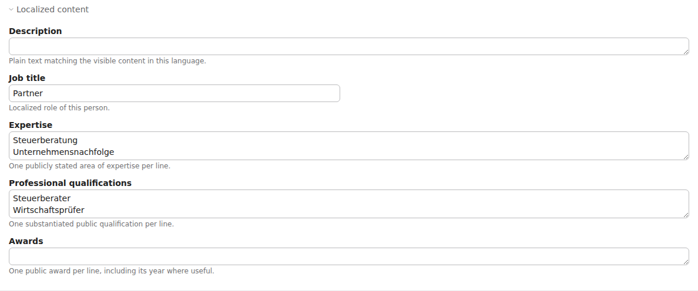

### Calendar-backed events (development branch)

The `codex/feature-calendar-events` branch adds optional integration with `contao/calendar-bundle`. Install the Calendar bundle matching your Contao version, update the extension, run `contao:migrate`, clear the application cache and install assets. Websites without Calendar can continue using standalone Event entities.

1. Create a normal Contao calendar, published event list page and event reader page. Set the calendar's reader page as usual.
2. In **AI helper → Websites and archives**, or the calendar editor, review its schema defaults: organiser, status, attendance mode and venue/address. **Enrich** enables the integration; **Suppress** removes only that calendar's Event nodes. Default mode preserves core output unless enrichment fields are configured.
3. Manage each event's title, dates, times, teaser, content and image in Contao. Blank schema fields inherit calendar defaults; event-specific values override them. Add an online URL for online/hybrid events, and explicitly mark cancellation or postponement. Changing schema status does not change the visible event title or body—keep those consistent yourself.
4. Link organiser, speakers/performers and relevant services/topics. AI content analysis can suggest supported extra metadata and relationships on active event records; it cannot change core scheduling or recurrence fields and must not create duplicate standalone Event entities.

The integration extends the Event emitted by Contao's template, preserving dates, description, image and contributions from other extensions. It respects the template's decision not to emit teaser-list events, connects emitted reader events to WebPage.mainEntity, and includes calendar events in the relationship graph. Organizer and related entity references only emit published entities. Calendar defaults and per-event changes invalidate the relevant caches.

**Current boundaries:** no ticket/Offer editor, booking integration, performer inference from author fields, automatic calendar-event translation creation or recurrence/exception expansion. Recurring records retain core dates and identity rather than inventing separate occurrences or an EventSeries. Translated event records currently keep their own identities. Standalone Event and calendar event records are separate workflows.

The development pilot has fictional EN/DE examples covering physical, online and cancelled hybrid events. Their list pages are `/en/schema-test-events-en.html` and `/de/schema-test-events-de.html`. All created record IDs are recorded in the application's `var/schema-event-fixtures.json` for targeted cleanup; these fixtures are not installed by the extension or its migrations.

Run `tests/calendars.php` from the pilot application root for rollback-only integration checks. It uses the fictional fixtures and tests inheritance, overrides, preservation of core data, suppression, publication filtering, AI target validation/application and parent review.

A **standalone Event** can use the entire homepage as its localized home. You do not need to create a Contao Calendar event. This is useful when a complete landing page represents one conference.

Events support dates, status, organizer, localized text, a physical venue with its full address, and offline/online/mixed attendance. Online and mixed events can include a public VirtualLocation URL. Dates accept `YYYY-MM-DD` or `YYYY-MM-DDTHH:MM:SS+HH:MM`. Event ticket offers and a Calendar-record adapter are not included. Never put private access tokens in the public event URL.

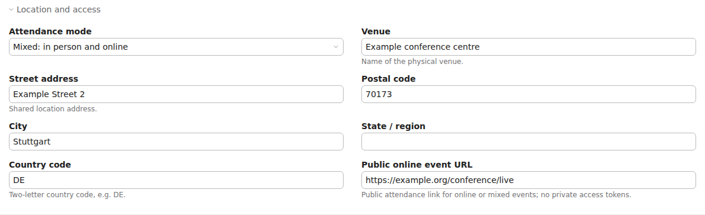

## Preview and validate

Save a localized record, then expand **Published JSON-LD preview**. **Saved output** displays the full saved JSON with automatic height and line wrapping.

The preview contains that entity, its referenced organization and linked service catalogue entries. It is **not the complete page graph** and does not display unsaved edits. Unpublished entities are omitted.

<details>
<summary>Example: full saved output for CMS Hosting</summary>

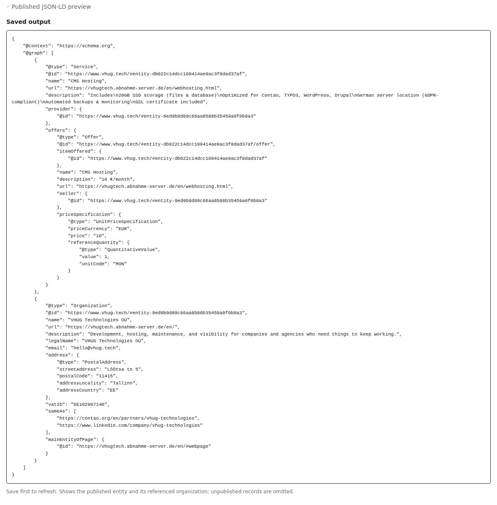

</details>

Check the rendered frontend too:

1. Visit the entity's home and another page referencing it, in each configured language.
2. Inspect the `application/ld+json` block using the `https://schema.org` context. Contao can also output a separate internal Page context; that is not a duplicate Schema.org page.
3. Confirm identities, names, localized home URLs, relationships and publication state.
4. Use the [Schema.org validator](https://validator.schema.org/) for vocabulary/graph validation and [Google Rich Results Test](https://search.google.com/test/rich-results) for Google's supported search features. A valid Service graph need not produce a dedicated Google rich-result preview.

A password-protected development URL cannot be fetched by public validators. Use their code input to test copied JSON/HTML, then validate the public deployment separately. Structured data must reflect the visible content; valid markup does not guarantee a particular search appearance. See [Google's structured-data guidelines](https://developers.google.com/search/docs/appearance/structured-data/sd-policies).

### Full organization or a compact reference?

**Current behavior:** Organization and LocalBusiness records emit their full details on their published localized home. On other pages, they emit a compact node containing `@type`, `@id`, `name`, the localized home `url` when available, and `logo` when configured. Publisher/provider relationships still reference the same permanent identity. Saved entity previews remain complete.

See [Organization output](docs/organization-output.md) for examples and the distinction between an ID reference and automatic data retrieval. See the [roadmap](docs/roadmap.md) for the separate image and product-hook branches.

## Everyday maintenance

| When something changes | Where to edit |
| --- | --- |
| Company name, address or phone | Shared Organization/LocalBusiness record, once |
| Service wording in one language | Its localized child and manual offer fields |
| A service moves to another page | Its representative-page selection; retain its permanent ID |
| Another page discusses a service/person | That page's Related entities |
| News headline, body or main image | The existing news record/content |
| A post's public author differs | The post's Author entity override |
| A post receives a substantive update | Its content and Content last revised field |
| A new language is added | Root setup and localized child records |
| Sharing image is unsuitable | Your existing theme/image/social extension; outside this release |
| A service is withdrawn | Unpublish the entity and update the visible content |

Preserve generated IDs when migrating or importing records. Removing and recreating an entity gives it a new identity; changing its home page does not.

### Troubleshooting

- **No localized output:** check parent publication, child publication, page publication/access and the page's derived language.
- **News fields are missing:** the default Contao mode and Article/NewsArticle/BlogPosting archives support author, about and mentions fields. Suppressed archives do not offer article enrichment; JobPosting uses its own fields.
- **News keeps the old output:** default Contao mode preserves the core type and identity while enriching configured relationships. For explicit article types, confirm archive publisher and generated article IDs; save the archive to fill missing IDs.
- **Preview seems stale:** save first, then reopen the preview. Manual values are the source in this release.
- **Duplicate schema or social tags:** check old HTML elements, theme templates and other extensions. The manager does not automatically remove handcrafted scripts or FAQ microdata.
- **Fields/module missing after an update:** review database updates, rebuild the application cache and check backend permissions.

## Current scope and limitations

Available in **1.0.0**: Organization, LocalBusiness, Person, Product, Service and standalone Event with physical/online venues; manual offers; localized homes; compact supporting organizations; page purposes; website publisher/identity; public news authors; archive-controlled article enrichment and JobPosting; saved previews; English/German labels.

Not included: smart/automatic page images, social-tag generation, pricing-source hooks, Product variants/inventory/reviews, full Event rich-result fields, FAQ adapters or a visual relationship overview. A valid Product or Event node does not by itself guarantee eligibility for Google's feature-specific rich results.

The [roadmap](docs/roadmap.md) links the separate ongoing feature branches. See [release notes](CHANGELOG.md) for the pilot-to-release transition.

## Developer notes

The bundle integrates with Contao's JsonLdManager/JsonLdEvent. It extends the existing graph rather than adding a separate handcrafted JSON-LD script for each entity. Standard news fields remain authoritative, while manually entered entity data is managed independently.

Run pure checks from the package directory:

```sh
php tests/mapper.php
php tests/manual-products.php
php tests/jobs.php
php tests/business-mapper.php
```

Run integration checks from a configured Contao application root, adjusting the package path for a `vendor/` installation:

```sh
php private-bundles/vonheldenundgestalten/contao-schema-manager/tests/dca.php
php private-bundles/vonheldenundgestalten/contao-schema-manager/tests/integration.php
php private-bundles/vonheldenundgestalten/contao-schema-manager/tests/business.php
php private-bundles/vonheldenundgestalten/contao-schema-manager/tests/news.php
php private-bundles/vonheldenundgestalten/contao-schema-manager/tests/page-metadata.php
```

The integration checks target the pilot fixtures: published DE/EN pages, a configured news archive/publisher/author and their website roots. Fixture database writes roll back. `SCHEMA_TEST_ORIGIN` sets the routing origin; `SCHEMA_TEST_DB_TCP=1` is an optional process-only workaround for jailed SSH without a local MySQL socket. Do not treat these as a universal fresh-install test suite.

See [development notes](docs/development.md) for the pilot's setup and verification history. Screenshot files in [docs/images](docs/images) were captured from the actual backend on 2026-10-03; credentials, browser sessions and capture helpers are not included.

People and organizations can select **Linked knowledge topics** on the entity record (for example, an existing SEO service). These shared `knowsAbout` references appear in the relationship graph and complement the localized **Expertise** text in each translation. Only published targets are emitted in frontend JSON-LD. Knowledge links do not imply that the person provides or manages the service.

Event venue latitude/longitude are optional manual fields, excluded from AI suggestions. Supply both decimal coordinates; an empty event pair inherits the calendar pair. A partial event pair never mixes with calendar coordinates. Online-only events do not output physical coordinates.
The AI content stage can suggest Persons for named authors of published news and connect them through the existing backend-user Person mapping. Author mapping requires an administrator. Only the author name, record reference and existing Person mapping enter the analysis, never account contact or login details. Disabled logins remain eligible when their articles are published. Existing mappings and per-news author overrides are preserved; drafts prevent duplicate Persons. Members are not scanned. Start a fresh discovery analysis to include author evidence in previously scanned articles.
The AI content stage can suggest Persons for named authors of published news and connect them through the existing backend-user Person mapping. Author mapping requires an administrator. Only the author name, record reference and existing Person mapping enter the analysis, never account contact or login details. Disabled logins remain eligible when their articles are published. Existing mappings and per-news author overrides are preserved; drafts prevent duplicate Persons. Members are not scanned. Start a fresh discovery analysis to include author evidence in previously scanned articles.

### Existing structured data and migration review

Before discovery, open **Existing structured data** in the AI helper. This repeatable audit needs no API key and makes no AI calls. It reads the public HTML of eligible pages in small batches, parses JSON-LD without executing scripts, identifies known Schema Manager identities, and shows possible duplicate entities with their existing/replacement data and differing properties. HTTP authentication, redirects, invalid JSON and unknown origins are reported, not treated as a clean result.

Only exact, local HTML content-element origins are offered for retirement. An element must contain JSON-LD only, and every top-level entity must have a unique published replacement preserving all compared properties. Differences block retirement until reviewed/resolved; templates, reused/dynamic elements and visible HTML must be edited manually. Select retirement explicitly. Applying re-fetches the page, rechecks the replacement and content fingerprint, and disables the element with a Contao version rather than deleting it. No existing entity is rewritten by the audit.

Published entities with unpublished translation/home records now show a visible warning with an editor link. Publish reviewed child records separately to expose their localized details. In AI reviews, **Select all suggestions** selects additions and empty-field suggestions; populated-field replacements require individual selection after reviewing old/new values. Existing names and descriptions are not rewritten merely for stylistic improvements.
