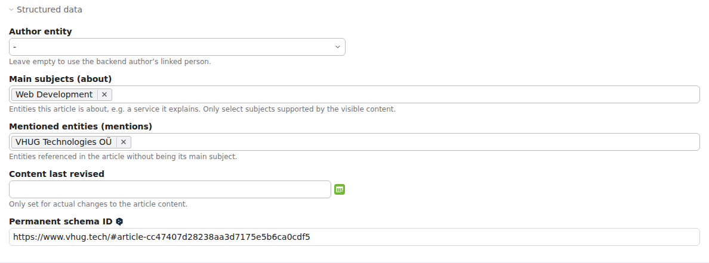
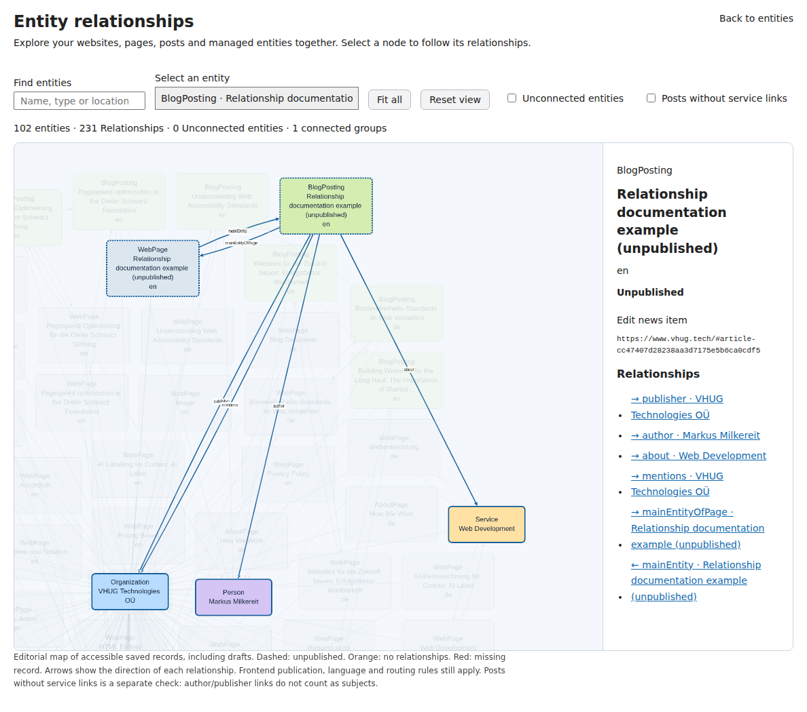

# Entity relationship map (feature branch)

Available since **1.1.0**. Apply the normal Contao database update for the optional News fields (`schemaAbout`, `schemaMentions`) and entity field (`knowledgeTopics`). Existing content/output is unchanged until editors select topics or mentions.

## Library choice

[Cytoscape.js](https://js.cytoscape.org/) provides graph analysis, directed edges, selectable nodes and disconnected components without a framework dependency. We use its [fCoSE layout plugin](https://github.com/iVis-at-Bilkent/cytoscape.js-fcose) for readable spacing. [vis-network](https://visjs.github.io/vis-network/docs/) was another suitable option; Cytoscape's graph traversal/connected-component API fits the missing-relationship workflow. [Sigma](https://www.sigmajs.org/docs/) targets large WebGL graphs and brings Graphology; that is unnecessary for an editorial entity map.

The exact releases, MIT licenses and SHA-256 hashes are in `public/vendor/*/README.md`. Assets are served by Contao locally, with no runtime CDN, telemetry, or transfer of graph data to a third party. Updating the libraries is a deliberate vendor update followed by browser verification; Composer consumers do not need Node or an npm build.

## What it shows

- Every saved managed Organization, LocalBusiness, Person, Service, Product and Event, including unpublished records.
- Accessible Contao WebSite roots and WebPage records, their chosen page subtypes, localized main entities, about references, publishers and isPartOf links. Shared translated website roots resolve to one WebSite node.
- Every accessible News record: BlogPosting/Article/NewsArticle or JobPosting according to archive settings; suppressed records are labelled explicitly. Author overrides, backend-user Person mappings, publisher/employer, translationOfWork, about and mentions connect them to the graph. A native core author without a shared identity remains a distinct Person node with a warning.
- Separate reader WebPage nodes for each managed post URL, connected through mainEntity/mainEntityOfPage and the website. A shared reader record must not collapse different article URLs into one page node.
- Parent organization, employer, provider, organizer, configured offer seller, memberships, workplaces, explicit/inferred office and subsidiary relationships, and service-catalogue links.
- Relationships point from the subject to the related entity. Reciprocal parent/location links are intentional; exact duplicates are collapsed.
- Full name and type, with street and postal locality for LocalBusiness. Entity identity and localized home assignments appear only when selected.
- Orange borders for entities with zero entity relationships, dashed borders for drafts and red placeholders for missing referenced records. Unconnected entities are not automatically errors. Separate connected groups are also retained.

This is an **editorial map of saved configuration**, not a crawler or a claim that every configured edge is currently published. For example `offers.seller` is the configured seller; an actual offer also requires a valid translated offer/home. Catalogue entries, drafts and language-specific data remain subject to the existing frontend output rules. Use the saved output preview and actual page JSON-LD to verify publication.

Page assignments now form real mainEntity/mainEntityOfPage links. Missing references to managed entities appear as red placeholders. References to inaccessible pages or News records are omitted rather than leaking protected record titles. The graph still does not crawl arbitrary frontend JSON-LD or expand inline ImageObject/Offer/ContactPoint/value objects as separate nodes. It does not infer topic links from titles, matching names or sameAs URLs.

### Blog subjects and service links

In an archive using BlogPosting, Article or NewsArticle, open a News record's **Structured data** section:

- **Main subjects (about)**: entities the article is about, such as a service it explains.
- **Mentioned entities (mentions)**: entities referenced without being its principal subject.

Both are multi-select pickers for existing entities. They add stable @id references and include published target entities in the actual article JSON-LD, preserving subjects supplied by templates or other graph contributors. Unpublished/deleted targets are omitted from frontend output. Each translated News record has its own selections: choose what its visible content actually covers. Jobs and core/suppressed archive modes do not expose these article fields.

**Posts without service links** highlights article nodes with no direct about/mentions relationship to a Service. Author, publisher, page and website connections do not satisfy this check. It is a review aid, not a requirement that every article promote a service.

The screenshots use an unpublished documentation example; the example is removed after verification.

## Language, visibility and layout

Pages configured with `noindex` in Contao's robots field are excluded from this visualization, along with their reader-page instances and posts routed through those noindex readers. Other pages are evaluated individually; an indexed child is not hidden merely because its parent is noindex. Shared business entities remain visible even if their representative page is excluded. This filter does not change publication, robots settings or frontend JSON-LD.

The **Language** selector defaults to the backend language where available (otherwise the first available language), and remembers your selection for this browser session. **All languages** is also available. Pages/posts from other languages and their edges are removed from the current view; shared business entities and shared websites remain. Services, products and events use their published translated name where available. Counts, orphan checks, the entity selector and details reflect the current view. Records whose language cannot be resolved remain visible rather than being silently assigned a language.

**By relationships** uses the force layout plus card separation; a strict library grid with `avoidOverlap` is the fallback if relaxation cannot resolve all collisions. **Grouped by type** places each type in its own spaced grid block. Both calculate spacing using card/label dimensions and rearrange after language changes. These are automatic positioning rules; editors can still drag cards manually.

## Backend use

Open **Content → Structured data → Entity relationships**. Drag nodes, zoom and pan; select one to label its relationships and see details. Selecting a node zooms into its immediate relationships. Labels stay on selected edges; no all-label toggle was added. The entity selector and relationship buttons provide a keyboard alternative to the canvas. Search highlights matches without deleting other records. **Unconnected entities** highlights nodes with no entity edges. **Fit all** restores the full framing; **Reset view** clears selection and filters.

The feature uses the existing Structured data module permission. Content sources additionally require the Page/News module and per-record Contao ReadAction authorization, including page mounts and archive access. Native author nodes expose only the name already used by core article markup, not login/email data. The graph view itself has no write API. Editing opens the existing entity editor and its normal permission checks.

## Verification

Run `composer test` for mapping checks (cycles, directions, inferred/explicit deduplication, disconnected records, missing targets, location labels, empty datasets). With Playwright and Chromium installed, run `python3 tests/browser-relationship-map.py` for offline rendering, search, selection, draft/missing/orphan styling, hostile label handling, mobile width and Turbo lifecycle checks.

Real backend testing on the pilot verifies the list action, local assets, authenticated rendering, entity selection and edit navigation. The temporary unpublished News fixture is removed after browser tests; existing records are not changed. `tests/news.php` also checks real about/mentions output, contribution preservation and unpublished-target suppression. `tests/content-map-source.php` verifies per-record authorization against an installed database. Layout spacing is checked on the full pilot graph.

Cards emphasize the entity name, with a smaller type above it. LocalBusiness cards also show their location. Language stays in the filter, selection list and details rather than repeating on every card.

Bare pages with **Require an item** enabled are omitted. Their metadata remains available to build the actual article detail pages, including language, website and subject relationships. Cards size themselves to the wrapped title and optional location, with consistent padding.
